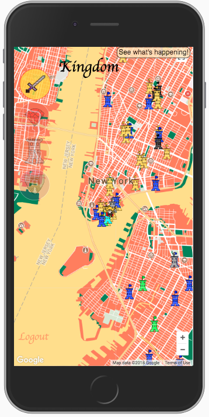

## Welcome to Kingdom: a game of neighborhood pride

Play Kingdom at http://www.kingdom.netlify.com

## Game Rules

Welcome to Kingdom: a game of neighborhood pride.

Pledge your Allegiance:
Sign up with your Foursquare account, and supply your address.
You will be assigned your kingdom based on the neighborhood you
live in.

Gain Experience:
Retrieve your Foursquare checkins to get a jumpstart on you Kingdom experience.
Begin checking in at local establishments to boost your personal experience,
and the strength of you kingdom.

Conquer an Establishment:
Each time a kingdom checks in to an establishment for the first time, a
new castle is forged. The Kingdom with the strongest castle (greatest number of
checkins), declares that establishment as part of their kingdom.

Become the keeper:
Checkin to an establishment more than anyone else and you become the keeper.
The keeper gains 1 experience point each time another player checks into
their establishment.

Become the King:
Own the most establishments within your kingdom, and become the king of your
realm.

## Technologies
React 
Redux 
Node 
Express 
Sequelize 
PostGres 

## Developers

Bruce Leong - https://github.com/bruceleong 
Connor Kirkwood - https://github.com/cdkirkwood 
Dongwoo Kang - https://github.com/schach0415 
Philip Gingerich - https://github.com/horseeyephil

